# Project1 实验报告

> Author：李懋良

## 一、任务概述

本实验要求完成能够实现7条基本指令的多周期CPU{addu，subu，ori，lw，sw，beq，jal}，采用Verilog语言编程，并完成仿真验证。

## 二、系统模块设计

### FSM图

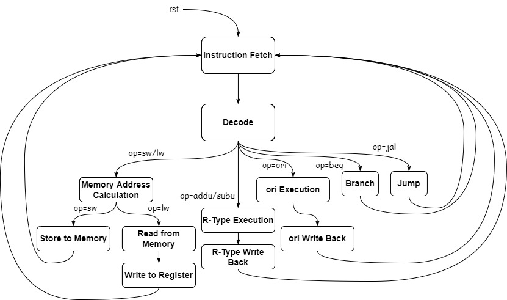

### 关键时序

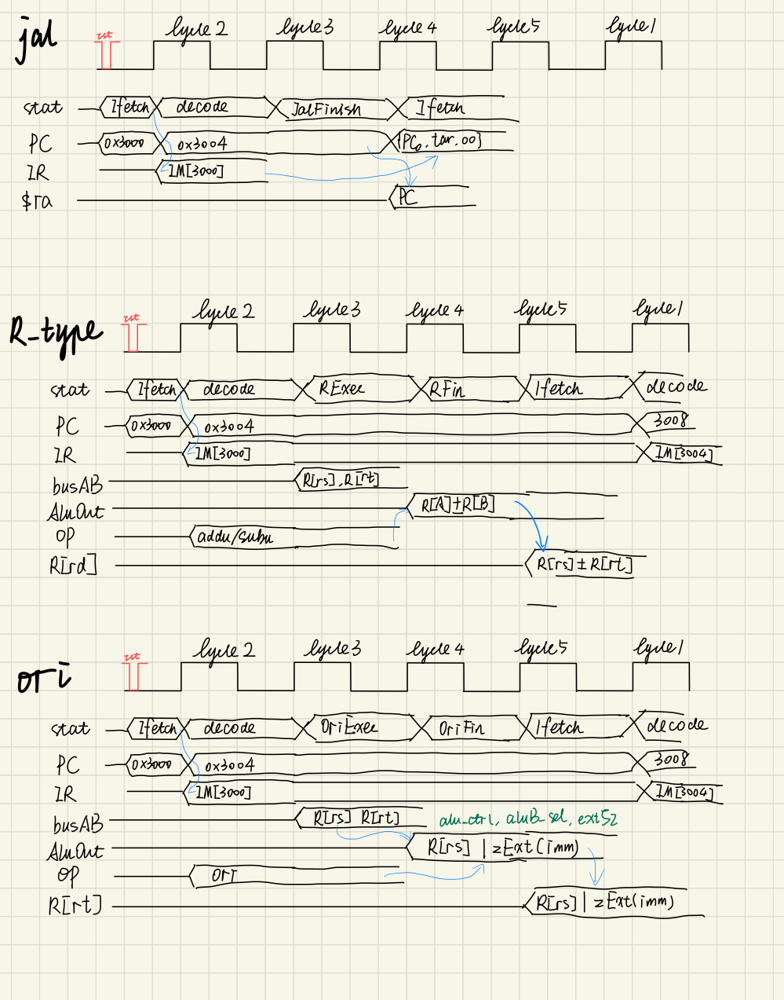

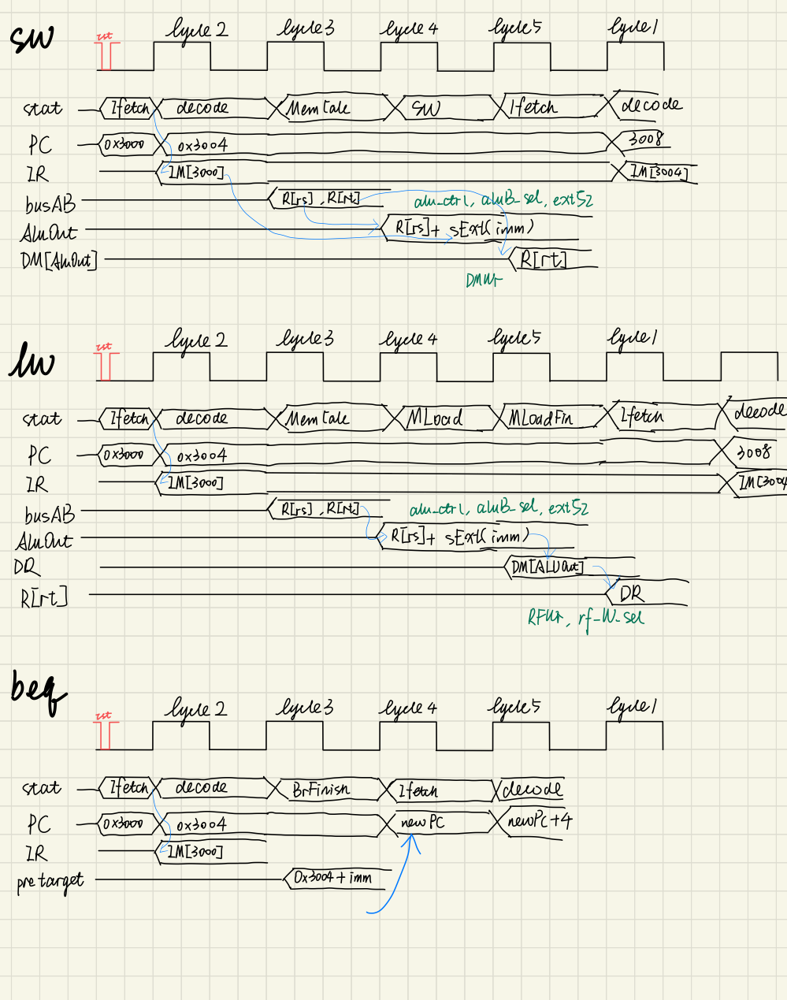

### 模块说明

#### reg_file.v

```verilog
module rf (
  input [4:0] A,      // 读取A号寄存器
  input [4:0] B,      // 读取B号寄存器
  input [4:0] W,      // 写入W号寄存器
  input [31:0] din,   // 写入数据
  input RFWr,         // 写入控制 1-允许，2-拒绝
  input clk,          // 时钟
  output [31:0] doutA,// A号寄存器内容
  output [31:0] doutB // B号寄存器内容
);
```

####  pc.v

```verilog
module pc (
    input [31:0] NPC, // 写入数据，这里为了方便不省略最低两位
    input PCWr,       // 写入控制信号，1-允许，0-拒绝
    input clk,        // 时钟
    input rst,        // 复位信号
    output reg [31:0] PC // 输出信号为当前的PC
);
```

#### decoder.v

```verilog
module decoder (
    input [31:0] inst,   // 指令字
    output reg [2:0] op, // 指令码
    output [4:0] rs,     // 
    output [4:0] rt,     //
    output [4:0] rd,     //
    output [15:0] imm,   //
    output [25:0] target // 无论是不是应该这样解释，都直接输出
);
```

#### utils.v

```verilog
module alu (
    input [31:0] A,       // 输入A
    input [31:0] B,       // 输入B
    input [1:0]  ALUctrl, // 控制信号，00->加, 01-> 减, 10->或
    output ZF,            // 0标志，如果运算结果为0则将此标志置1
    output reg [31:0] ALUout
);
module extender (
    input [15:0] w_in, // 输入半字
    input extSZ, // 0 -> zero exr, 1 -> sign ext
    output [31:0] dw_out // 输出字
);
module mux2to1 ( selA, selB, sel, mux_out );
module mux3to1 ( selA, selB, selC, sel, mux_out);
module mux4to1 ( selA, selB, selC, selD, sel, mux_out);
```

## 详细设计

数据通路及控制信号如下

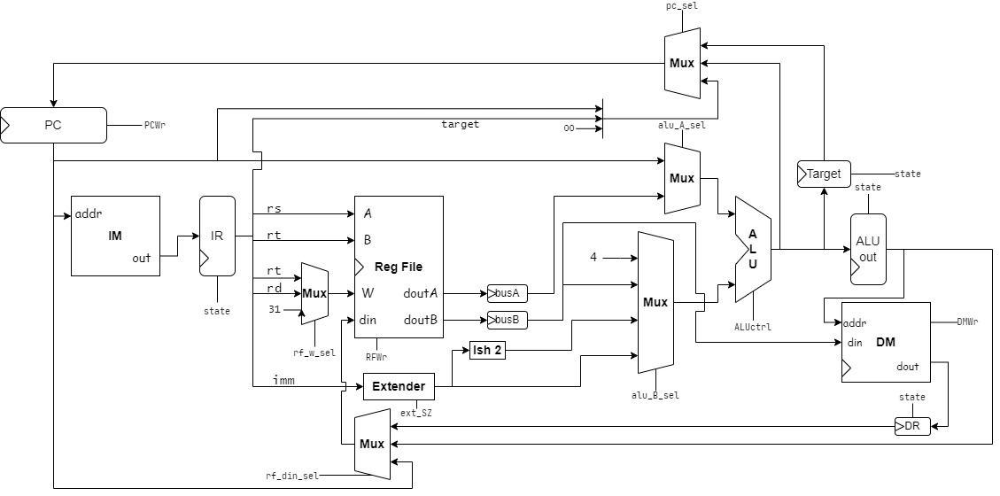

图中所有的控制信号均由操作码`op`（在Decoder周期中由IR寄存器的内容得出）和状态量`state`决定。中间的缓存寄存器也都是由`state`信号进行控制写入。

> 这个设计图的主要部分来自于老师的上课视频，自己加了一个`jal`指令的支持，然后对于分离的指令和数据存储器进行了一些修改。

## 编码说明

寄存器`$0`需要初始化（因为MIPS要求`$zero`寄存器始终为零，不过我是在仿真挂掉的时候才想起来的），其余寄存器和内存可以不管（也就是仿真时会出现x），不然可能会出现一些问题。在复位的时候，Test bench写得是上升沿复位，需要注意一下。

```verilog
module rf(...);
parameter N = 32;
reg [31:0] reg_file[N-1:0];

always @(posedge clk, posedge rst) begin
  if (rst) begin
      reg_file[0] <= 32'b0;
  end // 需要写复位
  else if (RFWr) reg_file[W] <= din;
end
assign doutA = reg_file[A];
assign doutB = reg_file[B];
endmodule
```

PC模块和说明里面给的定义不一样，并没有省略低2位，因为这样会使得代码多出来一些冗余的步骤。实际上对于PC计算和算数运算共用一个ALU的情况下，把PC写成30位反而不合适（因为在用32位的ALU运算的时候还要把低2位的00给补回来，传进去的时候则需要把低2位扣掉）。至于说明文件里面的情况，它的PC是单独用一个PC计算模块里面放了一个单独的ALU，所以写30位会节约时间和空间，也不涉及多余的转换。

```verilog
module pc (...);
always @(posedge clk, posedge rst)
  if (rst) PC <= 32'h3000;
  else if (PCWr) PC <= NPC;
endmodule
```

## Test bench

测试直接用了老师提供的那个文件，就改了一下里面的符号名称。为了方便调试，我在存储器的描述里面加了调试代码，可以在存储器发生变化的时候打印相关信息。

```verilog
always @(posedge clk, posedge rst) begin
  if (rst) begin
    for (i = 0; i < N; i = i + 1)
      reg_file[i] <= 32'b0;
  end
  else if (RFWr) begin
    reg_file[W] <= din;
    `ifdef DEBUG
      $display("$%d <- 0x%8X", W, din);
    `endif
  end
end
//........
   always @(posedge clk) begin
      if (DMWr) begin
         dmem[addr] <= din;
         `ifdef DEBUG
            $display("M[0x%8X] <- 0x%8X", addr, din);
         `endif
      end
   end // end always
```


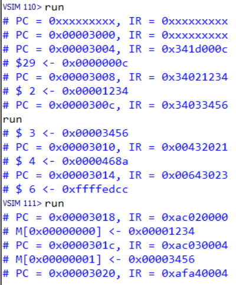

## 仿真结果

指令`ori $29, $0, 12`

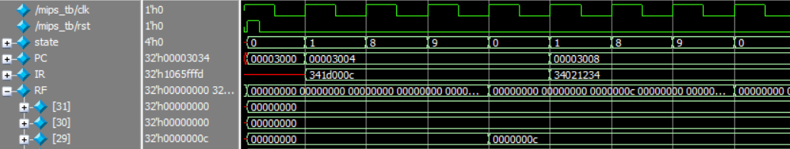

可以看到在`ori`指令的第四个周期后，29号寄存器被写入为12。PC和IR寄存器的变化符合前述的时序图。

指令`addu $4, $2, $3` 和`subu $6, $3, $4`

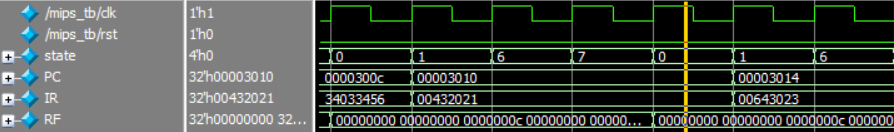

可以看到在addu指令的第四的周期后的时钟沿，4号寄存器被写入为`$3`和`$2`之和。然后是一条subu指令，在四个周期之后结果写入6号寄存器。

指令`sw $4, 4($29)`

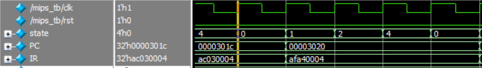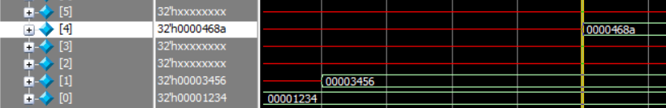

此时的`$29`寄存器里面放的是12，然后偏移4，就是16。因为是4字节编址，所以是存储器4号位被写入寄存器`$4`的内容。

指令`lw $5, 0($0)`

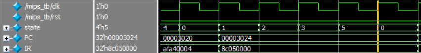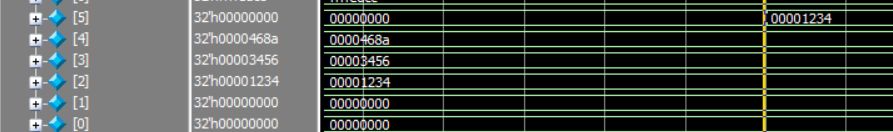

从数据存储器的0号地址读取数据写入5号寄存器。从上一张图可以看出，0号地址对于的存储器里面是`0x00001234`，然后在最后一个周期后的时钟沿看到它出现在5号寄存器里面，符合预期。

指令`beq $2, $5, _lb2`，其中`_lb2`是两条指令之后的位置，所以偏移量为1

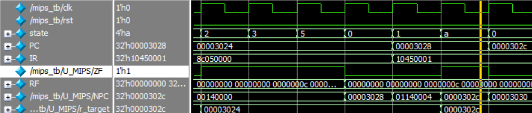

这里注意到在最后一个周期，提前计算的跳转地址被正确的写入了预计算寄存器`r_target`里面。判断ZF有效后写入PC。正好从`0x00003024`跳过两条指令来到`0x0000302c`。

指令`jal F_Test_JAL`，其中`F_Test_JAL`在`0x0000303C`

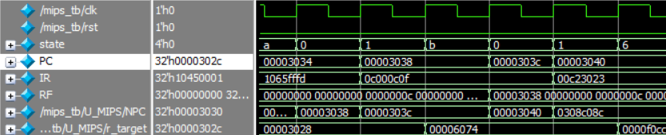

这里是无条件跳转，可以看到在跳转后的第一个时钟沿，目标地址`0x0000303C`被写入PC，随后递增为4。同时，还有31号寄存器`$ra`被写入原来的PC作为返回地址（可惜这里没有返回指令）。

## 总结

1. 本次遇到的最困难的地方在于，信号线太多了，很多地方一不小心就写错了。以后可以把各个部分的信号也一起标在图上，应该可以有效减少把线给连错的情况。（因为这代码不像画图，信号的连接不是很清晰）
2. 调试的时间和写代码的时间的总和是一样的。这次我花了更多的时间在事先画图和分析时序上，最后调试的过程就比较的顺利，基本上把不小心写错的地方改掉就通过了。时序分析还是非常重要的，我发现一旦把每个周期要干什么，哪些量会发生变化都搞清楚之后，整个代码编写的过程就很轻松，按着周期把控制信号给填进去就结束了。
3. 第一次觉得听课是有用的，这次把几个视频看完了之后，这个实验的所有内容就基本上清楚了，比看书要高效。这几个视频讲的非常好。