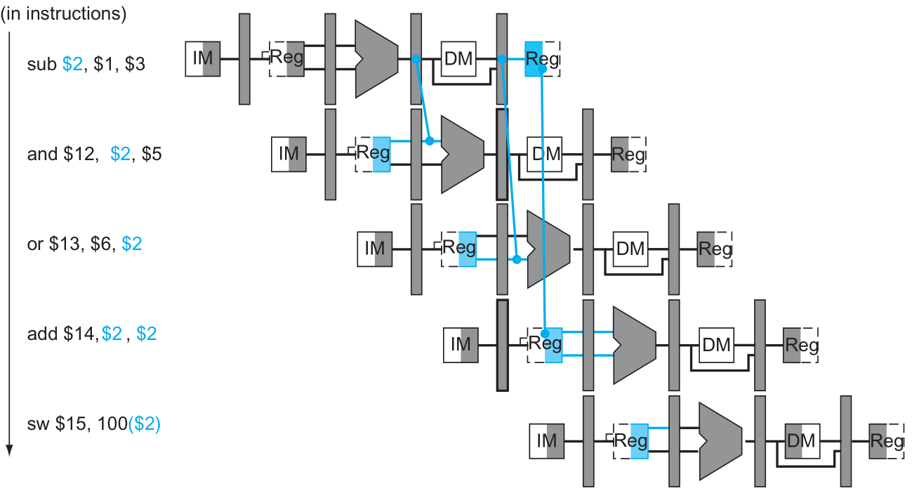
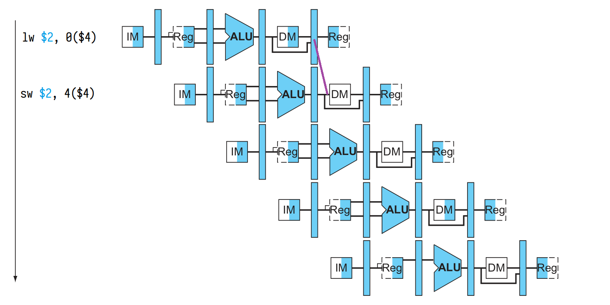
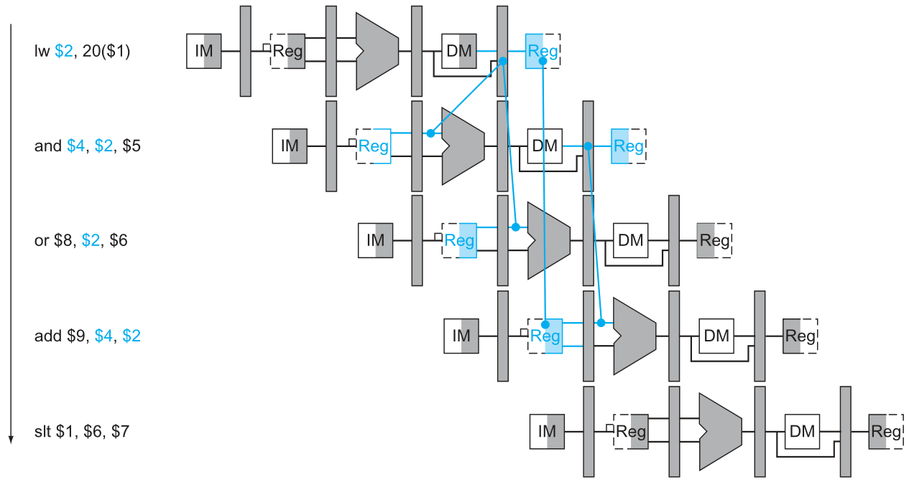
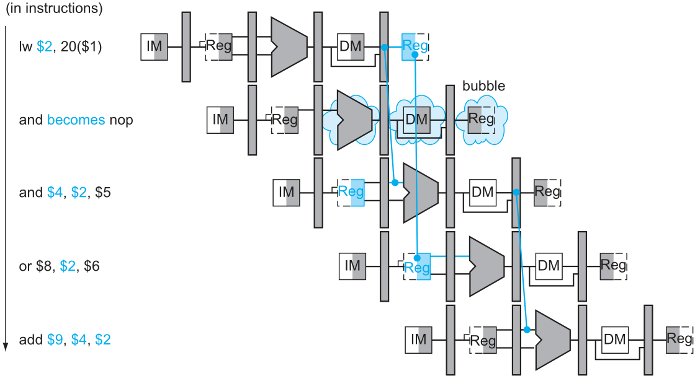

# MIPS7-Pipelined设计文档

## 冒险解决方案

### 数据冒险

1. **寄存器读写依赖：**

   因为前面的运算指令在读取的时候就已经计算完成了，所以可以通过ALU旁路。

   需要注意的是，这里的旁路都是从流水线寄存器里面旁路的，所以用目标级必须在可用的流水线寄存器的后面，而不能之间接运算部件。而RF的数据冒险是一个例外，可以进行同级旁路。

   **冒险检测：**

   1. 前后指令

      ```rust
      if EXMM.RegWrite
      && EXMM.RegisterRd != 0
      && EXMM.RegisterRd == IDEX.RegisterRs
      { ForwardA = 10 }
      if EXMM.RegWrite
      && EXMM.RegisterRd != 0
      && EXMM.RegisterRd == IDEX.RegisterRt
      { ForwardB = 10 }
      ```

      这个没啥难度，之间把EXMM寄存器的`ALU_result`给送到下一条指令的ALU里面就行了

   2. 中间隔一条指令

      ```rust
      if MMWB.RegWrite
      && MMWB.RegisterRd ≠ 0)
      && !(EXMM.RegWrite 
        && EXMM.RegisterRd != 0
        && EXMM.RegisterRd != IDEX.RegisterRs)
      && MMWB.RegisterRd == ID/EX.RegisterRs { ForwardA = 01 }
      
      if MMWB.RegWrite
      && MMWB.RegisterRd ≠ 0)
      && !(EXMM.RegWrite 
        && EXMM.RegisterRd != 0
        && EXMM.RegisterRd != IDEX.RegisterRt)
      && MMWB.RegisterRd == ID/EX.RegisterRt { ForwardB = 01 }
      ```

      这里需要注意，因为书中给了一个特殊例子，就是三条连续指令读写同一个寄存器的情况，这是后就必须要防止第3条指令和第2条之间做了1类旁路后再和第1条做一次2类旁路。所以中间多加了一个否定条件。

   

2. **load指令后面跟着store指令**

   这个旁路是书上给出的习题类似的东西。不难，就是加一个检测单元。

   **冒险检测：**

   ```rust
   if EXMM.rt == MMWB.rd
   &&  EXMM.MemWrite
   &&  MMWB.RegWrite
     { FwdM = 1; }
   ```

   ~~这个MemRead信号比较的奇妙，不过我还是保留着吧，，，~~这个旁路可以一起顺便解决R-Type指令后面跟着Store指令的旁路问题，我们只需要把ALU_result和WBData的mux后的数据旁路过去就好了。

   

3. **load指令后面跟着非store指令**

   可以看到，这个指令无法旁路。所以必须暂停流水线。有两点需要注意，一个是，暂停完了并不需要单独的旁路了，因为这个旁路会有前面的第1种冒险的旁路机制帮我们解决；另一个是，隔一条指令的地方就不需要旁路了，因为本来可以旁路解决的地方被nop了一格，正好可以读到了。这里需要注意的是，nop只能清空控制信号，因为我们需要重复读取。

   **冒险检测：**

   ```rust
   if IDEX.MemRead
    &&(IDEX.RegisterRt = IFID.RegisterRs || IDEX.RegisterRt = IFID.RegisterRt)
    { stall_the_pipeline(); }
   ```
   
   至于如何插入空指令，我们直接把IDEX级的所有控制信号清空，同时还需要把PC更新给暂停一个周期。这样所有未进入EX阶段的部分都会重新执行一次前周期的指令。不过书上给的数据通路是把IFID寄存器的写入也给关掉了，这个我不是很清楚是否是必要的，因为只要PC不变的化，那么IFID寄存器的内容应该也是不会变的。
   
   
   
   

### 控制冒险

书上说为了把branch预测失败的cost降低到1个周期，可以把比较器和pc计算挪到了ID阶段。不过这样的话我们就需要加新的冒险检测和stall条件了，旁路也需要重新加，太繁琐了，所以我宁愿branch之后掉两条指令也不想做这个优化。

这个时候我们需要先考察一下旁路是否需要修改，好消息是，如果我们不把比较提前到ID阶段的话，旁路是完全不需要动他的。

然后就是处理一下跳转成功后的问题(我们先忽略分支预测，总是假设不发生跳转)。如果不跳转，那我们就直接取指令直到流水线的尽头。如果跳转，那就有问题来了。我们可能还需要一个新的BrPC。~~因为为了兼容J型指令，我们不得不把新地址计算单元给挪到ID级，虽然可以全部丢尽IF级，但是为了可能需要的扩展问题，我还不不把他们集成进一个单元吧。~~然后得产生PC_src信号，和IDEX、IFID两级寄存器的废弃信号。为了J-type无缝衔接，我不得不把J指令的判断和地址计算放到了IF单元，虽然这可能会使得设计变得复杂。

在废弃指令的时候需要特别注意，IFID级的废弃必须是全部打上0；对于IDEX级，可以和前面的lw的数据冒险一起用一个或门连进去。

